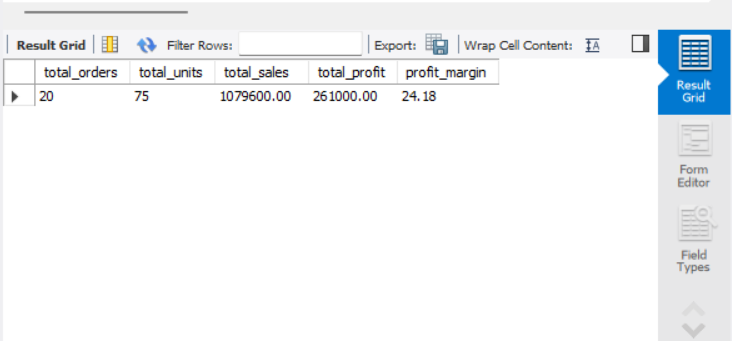
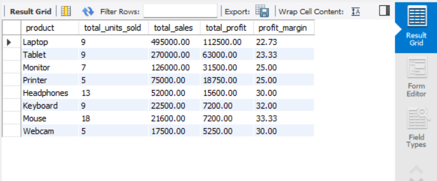
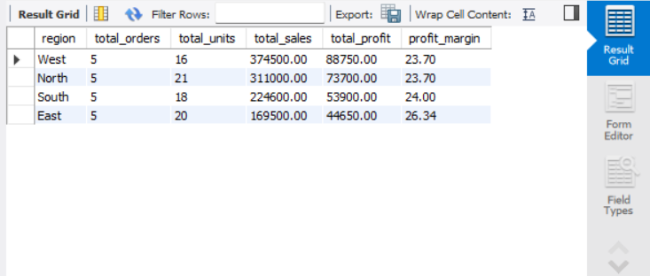
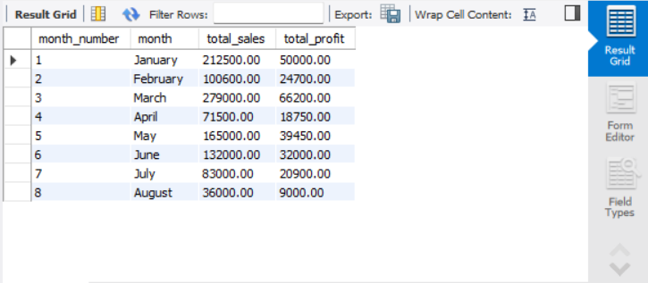
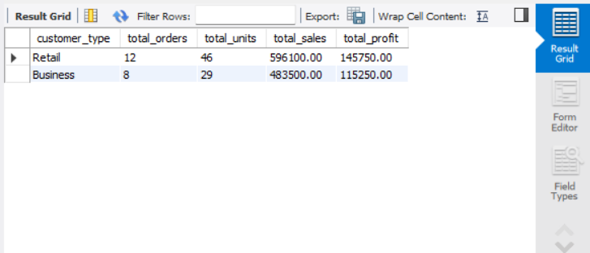

# E-Commerce Sales Analysis using SQL

## Project Overview

This project analyzes e-commerce sales data using MySQL to identify sales trends, product performance, customer performance, regional performance, and overall business KPIs.

The project demonstrates practical SQL skills commonly used by Data Analysts for business reporting, data analysis, and data quality validation.

## Objectives

The main objectives of this project are to:

- Analyze overall sales and profit performance
- Identify top-performing products
- Compare regional sales and profitability
- Analyze monthly sales trends
- Identify high-value customers
- Compare Business and Retail customers
- Rank products and orders based on sales
- Perform data quality checks
- Calculate important business KPIs

## Tools Used

- MySQL
- MySQL Workbench
- SQL

## Dataset

The dataset contains **20 e-commerce sales transactions**.

### Sales Table

The `sales` table contains:

| Column | Description |
|---|---|
| `order_id` | Unique order identifier |
| `order_date` | Date of the order |
| `customer_name` | Customer name |
| `region` | Sales region |
| `category` | Product category |
| `product` | Product name |
| `quantity` | Number of units sold |
| `unit_price` | Price per unit |
| `sales` | Total sales amount |
| `cost` | Product cost |
| `profit` | Profit generated from the order |

### Customers Table

A separate `customers` table contains:

| Column | Description |
|---|---|
| `customer_name` | Customer name |
| `city` | Customer city |
| `customer_type` | Business or Retail |

## Business Questions

The analysis answers the following business questions:

1. What are the total sales and total profit?
2. Which products generate the highest sales?
3. Which regions generate the highest sales and profit?
4. What is the monthly sales and profit trend?
5. Which customers generate the most revenue?
6. How do Business and Retail customers compare?
7. Which products rank highest by sales?
8. What are the top 5 highest-value orders?
9. Which order has the highest sales in each region?
10. What is the running total of sales?
11. Are there missing values in important columns?
12. Are there duplicate orders?
13. Are there invalid sales or profit values?
14. What are the overall business KPIs?

## SQL Concepts Used

This project demonstrates the following SQL concepts:

- `SELECT`
- `WHERE`
- `GROUP BY`
- `ORDER BY`
- `HAVING`
- `SUM()`
- `COUNT()`
- `AVG()`
- `MAX()`
- `MIN()`
- `CASE`
- `INNER JOIN`
- `LEFT JOIN`
- Common Table Expressions (CTEs)
- `RANK()`
- `ROW_NUMBER()`
- `LAG()`
- `PARTITION BY`
- Window Functions
- Running Totals
- Data Quality Checks

## Key KPIs

Based on the current dataset:

| KPI | Value |
|---|---:|
| Total Orders | 20 |
| Total Units Sold | 75 |
| Total Sales | ₹1,079,600 |
| Total Profit | ₹261,000 |
| Profit Margin | 24.18% |

## Analysis Performed

### 1. Overall Business Performance

Calculated total orders, units sold, sales, profit, and profit margin to provide an overall view of business performance.

### 2. Product Performance

Analyzed products based on:

- Total units sold
- Total sales
- Total profit
- Profit margin

### 3. Regional Performance

Compared regions based on:

- Number of orders
- Units sold
- Total sales
- Total profit
- Profit margin

### 4. Monthly Performance

Analyzed monthly sales and profit to understand changes in business performance over time.

### 5. Customer Analysis

Analyzed customer-level sales and profit and compared **Business** and **Retail** customer segments.

### 6. Advanced SQL Analysis

Used CTEs and window functions to:

- Rank products by sales
- Identify the top 5 orders
- Find the highest-sales order in each region
- Calculate running sales totals
- Compare consecutive orders using `LAG()`

### 7. Data Quality Analysis

Performed checks for:

- Missing values
- Duplicate order IDs
- Invalid sales values
- Negative profit
- Order date range

## Screenshots

### KPI Summary



### Product Analysis



### Regional Analysis



### Monthly Analysis



### Customer Analysis



## Project Structure

```text
sql-ecommerce-sales-analysis/
│
├── ecommerce_sales.sql
├── README.md
│
└── screenshots/
    ├── kpi_summary.png
    ├── product_analysis.png
    ├── regional_analysis.png
    ├── monthly_analysis.png
    └── customer_analysis.png